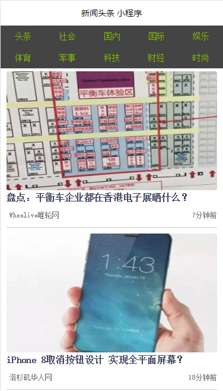
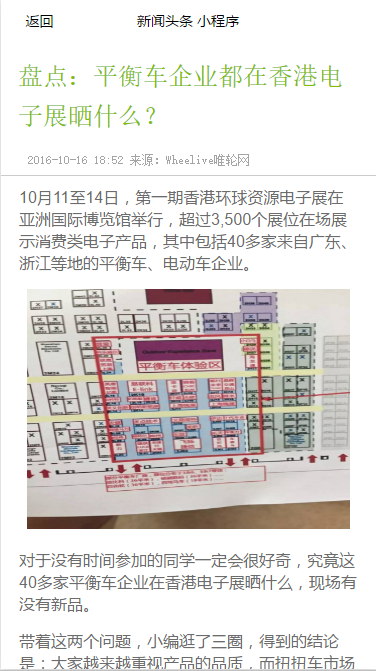

# wechat-newsapp

> 简介：这是一个新闻客户端的小程序版本，当然不能跟网易、腾讯之类的新闻客户端相比，这只是一个比较简易的版本。

# IDE的破解安装

由于微信小程序现在属于内测阶段，所以还没有正式的版本开放给所有的开发者，所以想要体验小程序的开发只能使用破解版的客户端。

详情请见https://github.com/gavinkwoe/weapp-ide-crack/，里面有详细的破解安装过程，这里就不再赘述了，破解完成导入项目即可。

## 首页

> 一些组件和框架的详细使用方法参见[微信小程序开发文档](http://wxopen.notedown.cn/)

### 效果

       

> 按照新闻所述领域和性质显示新闻列表，如，【头条】、【科技】等

### 页面头部

```
<view class="top-bar">
    <view class="top-bar-item" id="top" catchtap="onTapTag">头条</view>
    <view class="top-bar-item" id="shehui" catchtap="onTapTag">社会</view>
    <view class="top-bar-item" id="guonei" catchtap="onTapTag">国内</view>
    <view class="top-bar-item" id="guoji" catchtap="onTapTag">国际</view>
    <view class="top-bar-item" id="yule" catchtap="onTapTag">娱乐</view>
    <view class="top-bar-item" id="tiyu" catchtap="onTapTag">体育</view>
    <view class="top-bar-item" id="junshi" catchtap="onTapTag">军事</view>
    <view class="top-bar-item" id="keji" catchtap="onTapTag">科技</view>
    <view class="top-bar-item" id="caijing" catchtap="onTapTag">财经</view>
    <view class="top-bar-item" id="shishang" catchtap="onTapTag">时尚</view>
  </view>
```

> `catchtap`类似于`onclick`，点击触发`onTapTag`事件，加载对应类别的新闻列表。

### 新闻列表

```
<scroll-view class="posts-list" style="height:100%" scroll-y="true">
    <block wx:for="{{postsList}}">
      <view class="posts-item" index="{{index}}" id="{{item.url}}" catchtap="redictDetail">
          <image class="author-avatar" src="{{item.thumbnail_pic_s}}"></image>
        <view class="posts-title">{{item.title}}</view>
        <view class="author">
          <view class="author-name">{{item.author_name}}</view>
          <view class="posts-last-reply">{{item.last_reply_at}}</view>
        </view>
      </view>
    </block>
  </scroll-view>
```

#### wx:for

在组件上使用`wx:for`控制属性绑定一个数组，即可使用数组中各项的数据重复渲染该组件。

默认数组的当前项的下标变量名默认为`index`，数组当前项的变量名默认为`item`

```
<view wx:for="{{items}}">
  {{index}}: {{item.message}}
</view>
```

#### block wx:for

因为`wx:for` 是一个控制属性，需要将它添加到一个标签上。但是如果我们想一次性操作多个组件标签，我们可以使用一个``标签将多个组件包装起来，并在上边使用`wx:for`控制属性。

**注意：** `block`并不是一个组件，它仅仅是一个包装元素，不会在页面中做任何渲染，只接受控制属性。

## 新闻详情页

> 点击新闻后触发`redictDetail`事件跳转到详情页。

### 效果

        

### 新闻标题

```
<view class="detail-post">
    <view class="detail-post-header">
      <view class="detail-post-title">{{ detail.title }}</view>
    <view class="detail-post-meta">
      <view class="detail-post-info">
        <view class="detail-post-time">{{ detail.src }}</view>
      </view>
    </view>
    </view>
```

### 新闻内容

```
<view class="detail-post-content" wx:for="{{detail.item}}">
      <text class="content-info" index="{{index}}" wx:if="{{item.type == 'text'}}">{{ item.content }}</text>
      <image class="content-info" index="{{index}}" wx:elif="{{item.type == 'img'}}" src="{{item.content}}"></image>
</view>
```

#### wx:if

用`wx:if="{{condition}}"`来判断是否需要渲染该代码块：

```
<view wx:if="{{condition}}"> True </view>
```

用`wx:elif`和`wx:else`来添加一个else块，如：

```
<view wx:if="{{length > 5}}"> 1 </view>
<view wx:elif="{{length > 2}}"> 2 </view>
<view wx:else> 3 </view>
```

## 获取新闻列表

### http请求，wx.request(OBJECT)使用方法

​ wx.request发起的是https请求。**一个微信小程序，同时只能有5个网络请求连接。**

**OBJECT参数说明：**

| 参数名      | 类型            | 必填   | 说明                                       |
| -------- | ------------- | ---- | ---------------------------------------- |
| url      | String        | 是    | 开发者服务器接口地址                               |
| data     | Object、String | 否    | 请求的参数                                    |
| header   | Object        | 否    | 设置请求的header , header中不能设置Referer         |
| method   | String        | 否    | 默认为GET，有效值：OPTIONS,GET,HEAD,POST,PUT,DELETE,TRACE,CONNECT |
| success  | Function      | 否    | 收到开发者服务成功返回的回调函数，res = {data:"开发者服务器返回的内容"} |
| fail     | Function      | 否    | 接口调用失败的回调函数                              |
| complete | Function      | 否    | 接口调用结束的回调函数（调用成功、失败都会执行）                 |

**示例代码：**

```
wx.request({
  url: 'test.php',
  data: {
     x: '' ,
     y: ''
  },
  header:{
      "Content-Type":"application/json"
  },
  success: function(res) {
     var data = res.data;
  }
});
```

> 这里使用了[聚合数据](https://www.juhe.cn)提供的免费新闻API--[新闻头条](https://www.juhe.cn/docs/api/id/235)，通过http请求获取新闻列表。

**请求示例：**http://v.juhe.cn/toutiao/index?type=top&key=APPKEY

**返回结果示例：**(json格式)

```
{
    "reason": "成功的返回",
    "result": {
        "stat": "1",
        "data": [
            {
                "title": "巫山云雨枉断肠：女摄影师Erika Lust记录的性爱",/*标题*/
                "date": "2016-06-13 10:31",/*时间*/
                "author_name": "POCO摄影",/*作者*/
                "thumbnail_pic_s": "http://09.imgmini.eastday.com/mobile/20160613/20160613103108_7b015493398e7fd13dda3a5c
e315b1c8_1_mwpm_03200403.jpeg",/*图片1*/
                "thumbnail_pic_s02": "http://09.imgmini.eastday.com/mobile/20160613/20160613103108_7b015493398e7fd13dda3a5ce315
b1c8_1_mwpl_05500201.jpeg",/*图片2*/
                "thumbnail_pic_s03": "http://09.imgmini.eastday.com/mobile/20160613/20160613103108_7b015493398e7fd13dda3a5ce315
b1c8_1_mwpl_05500201.jpeg",/*图片3*/
                "url": "http://mini.eastday.com/mobile/160613103108379.html?qid=juheshuju",/*新闻链接*/
                "uniquekey": "160613103108379",/*唯一标识*/
                "type": "头条",/*类型一*/
                "realtype": "娱乐"/*类型二*/
            },
...]}}
```

> 在这个demo里，当页面第一次加载或者点击切换新闻列表时，会发起http请求获取新闻列表。

### 发起请求

```
wx.request({
      url: Api.getNewsList(data),
      success: function (res) {
          console.log(res);
        self.setData({
          postsList: self.data.postsList.concat(res.data.result.data.map(function (item) {
            item.last_reply_at = util.getDateDiff(new Date(item.date));
            return item;
          }))
        });
        setTimeout(function () {
          self.setData({
            hidden: true
          });
        }, 300);
      }
    });
```

## 获取新闻详情

> 由于`聚合数据`提供的API返回的只是新闻列表，以及新闻指向的具体URL。没有提供接口返回某条新闻的具体内容。而且微信小程序目前没有`webview`，无法直接跳转到对应的新闻地址。所以，如果我们想要将数据呈现出来，必须要对获取的网页内容进行切割，抓取我们需要的数据，进行渲染。

### 获取网页内容

在获取数据列表的时候，有每条新闻具体指向的URL地址。通过http请求该地址，即返回网页的内容（字符串形式）。请求方法和获取列表的方法一样，使用`wx.request(OBJECT)`。

### 内容切割

这部分内容只是一些字符串的操作，不必深究。

> 数据请求和内容切割的代码如下：

```
  wx.request( {
      url: Api.getNewsByUrl( id ),
      success: function( res ) {

        var arrContent = [];

        var tmpStr = res.data;
        var doSearch = true;//循环控制

        //object 获取整篇文章的图片和文字段落数量
        var allText = res.data.match( /(<p class="section txt">).*(?=\<\/p\>)/ig );
        var allImg = res.data.match( /(<a class="img-wrap").*(?=\<\/a\>)/ig );
        var allContentNum = allText.length + allImg.length;
// 获取新闻标题
        var title = tmpStr.match( /(<h1 class="title">).*(?=\<\/h1\>)/ig )[ 0 ].replace( '<h1 class="title">', '' );
        // 获取文章来源
        var srcInfo = tmpStr.match( /(<span class="src">).*(?=\<\/span\>)/ig )[ 0 ].replace( '<span class="src">', '' ).replace( '&nbsp;&nbsp;&nbsp;&nbsp;', ' ' );

        var contentType = null;//接收内容的类型，文字或图片
        var text = {};
        var img = {};

        while( doSearch ) {

          var tmpObj = {
            'type': null,
            'content': null
          };
          // console.log( tmpStr );

// 注：这里的正则表达式，跟上面的正则基本是一样的，只是在最后少一个g属性，加上g表示获取所有符合条件的数据，不加g表示获取第一个符合条件的数据
// 截取文章中出现的第一个文字段落的信息
          text = tmpStr.match( /(<p class="section txt">).*(\<\/p\>)/i );
          // 获取文章中出现的第一张图片的信息
          img = tmpStr.match( /(<a class="img-wrap").*(\<\/a\>)/i )

          // console.log( text );
          // console.log( img );

          if( text != null && img != null ) {
            if( text.index > img.index ) {//第一张图片出现的位置，小于第一段文字出现的位置，所以先显示图片
              contentType = 'img';
            } else {
              contentType = 'text';
            }
          } else if( text == null && img != null ) {
            contentType = 'img';
          } else if( img == null && text != null ) {
            contentType = 'text';
          } else {
            contentType = null;
          }

          if( contentType == 'text' ) {//文字
            text = tmpStr.match( /(<p class="section txt">).*(\<\/p\>)/i );//获取一段文字内容（对象类型）
            var content = text[ 0 ].substring( text[ 0 ].indexOf( ">" ) + 1, text[ 0 ].lastIndexOf( "</" ) );
            tmpObj.type = 'text';
            tmpObj.content = content;
            arrContent.push( tmpObj );
            tmpStr = tmpStr.substring( text.index + text[ 0 ].length, tmpStr.length );
          } else if( contentType == 'img' ) {//图片
            img = tmpStr.match( /(<a class="img-wrap").*(\<\/a\>)/i )
            // console.log(img);
            // 默认图片类型为jpg
            var imgType = 'jpeg';
            if( img[ 0 ].indexOf( ".jpeg" ) == -1 ) {
              imgType = 'png';
            }
            var content = img[ 0 ].substring( img[ 0 ].indexOf( "http" ), img[ 0 ].indexOf( imgType ) + imgType.length );
            tmpObj.type = 'img';
            tmpObj.content = content;
            arrContent.push( tmpObj );
            index = tmpStr.indexOf( '</figure>' );
            tmpStr = tmpStr.substring( index + 11, tmpStr.length );
          } else {
            doSearch = false;
          }


          if( arrContent.length >= allContentNum ) {
            doSearch = false;
          }

          // console.log( tmpObj );
          // console.log( arrContent );
        }


        var DATA = {
          'title': title,
          'src': srcInfo,
          'item': arrContent
        }

        self.setData( {
          detail: DATA
        });
        setTimeout( function() {
          self.setData( {
            hidden: true
          });
        }, 300 );
      }
    });
```

## 总结

就目前的感受来说，小程序的内容还不是太完善，比如`webview`，期待后续的版本^_^。